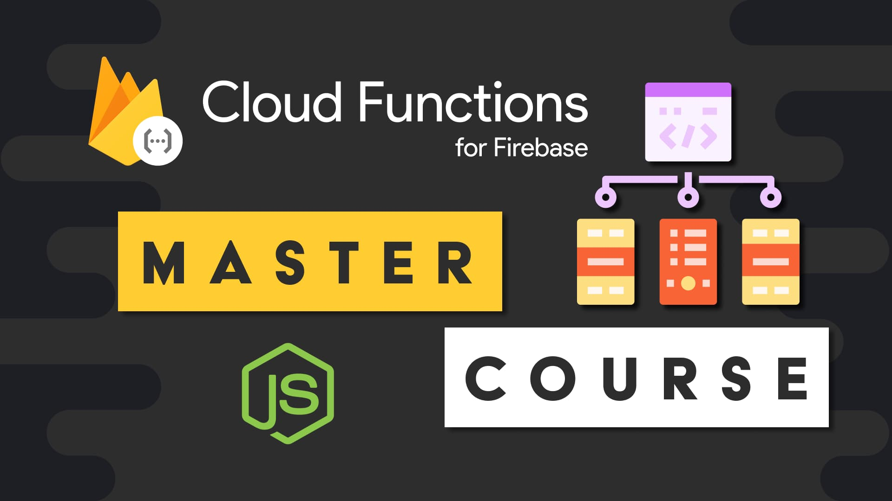

This course takes a hands-on approach to Firebase Cloud Functions where seven different microservices are built, each demonstrating a fundamental concept of the platform. Here’s a quick summary of the topics.

- Serverless Computing Basics
- HTTP and ExpressJS
- Event-driven Background Functions
- Firestore Functions
- Storage Buckets and the Functions Filesystem
- Working with Google APIs
- Callable Functions and Authentication
- Working with 3rd party APIs like Twilio to send SMS Text messages
